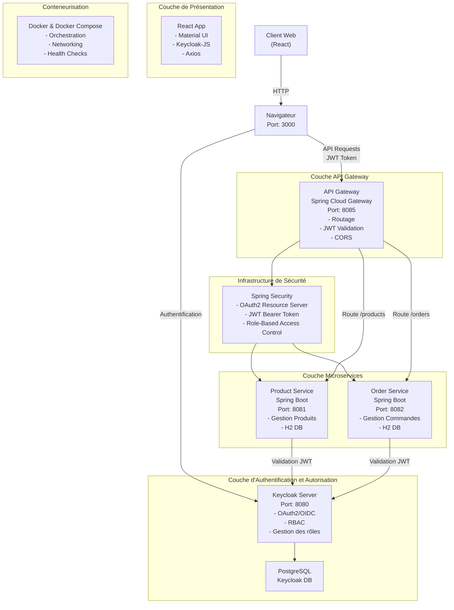
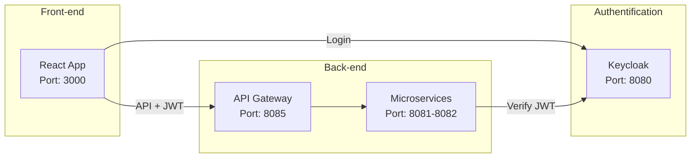
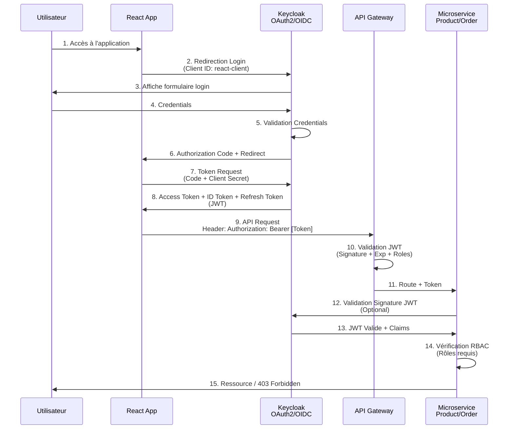
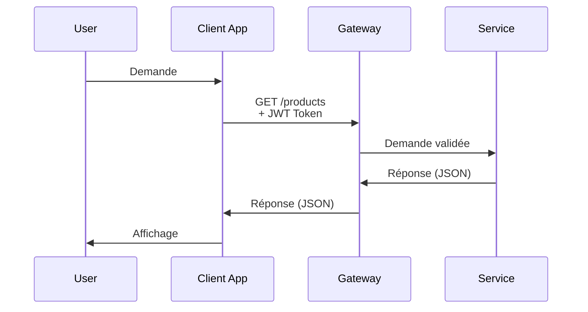
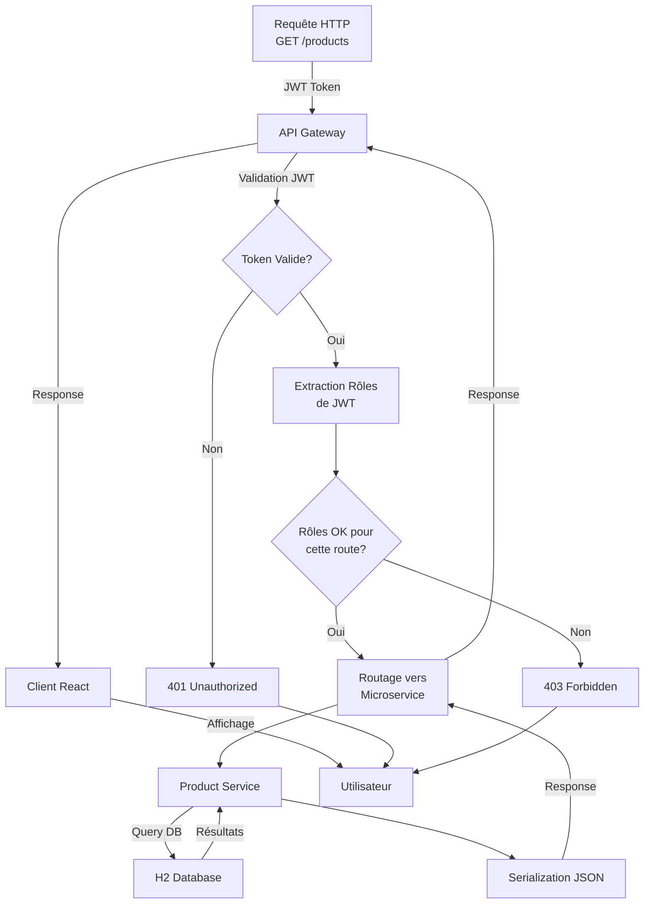
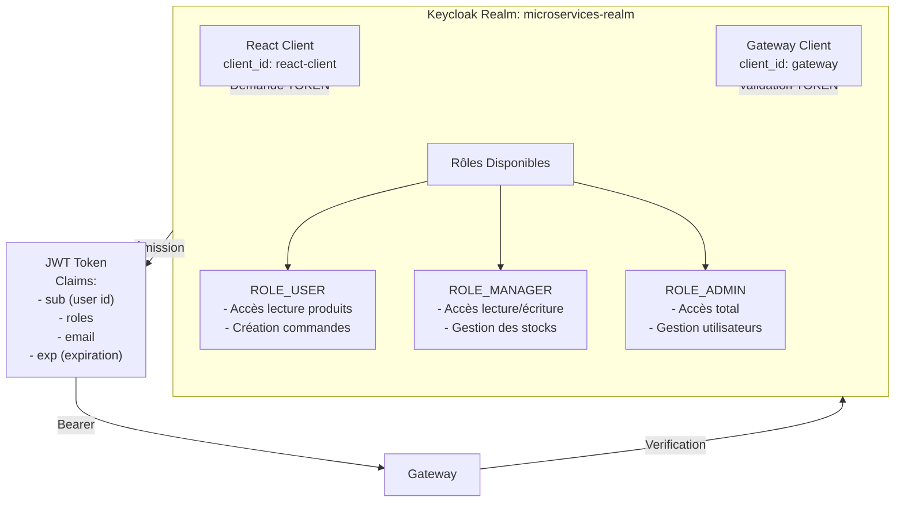
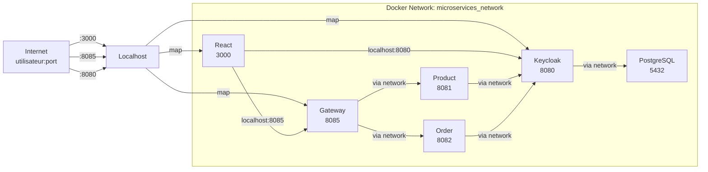
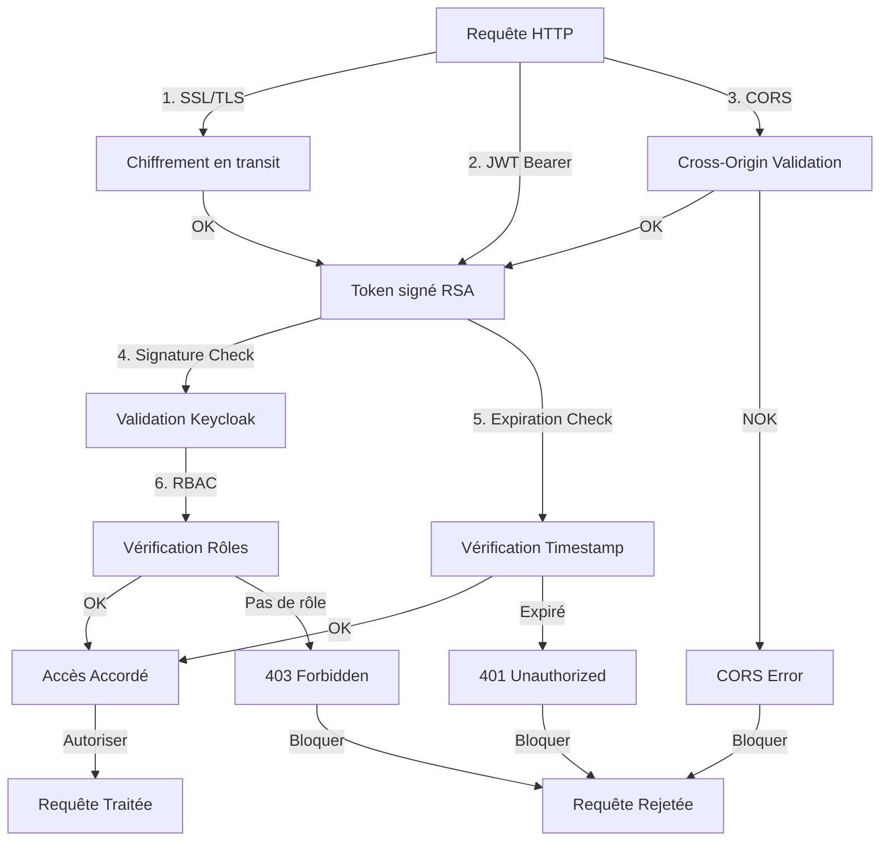

# Architecture et Flux Générales

## Vue d'ensemble

Ce projet implémente une architecture microservices sécurisée avec authentification OAuth2/OIDC centralisée via Keycloak. L'application gère un e-commerce avec des services indépendants pour les produits et les commandes, orchestrés par une passerelle API.

---

## Architecture Détaillée

### Schéma d'architecture détaillée

---

## Schéma d'architecture Minimal

### Pour une compréhension rapide

---

## Flux d'authentification Détaillé

### Processus complet OAuth2/OIDC

---

## Flux de requête Minimal

### Processus simplifié

---

## Flux de requête avec gestion des rôles Détaillé

---

## Architecture des rôles RBAC

---

## Composants Technologiques

### Stack Technologique

| Couche | Technologie | Version | Rôle |
|--------|-------------|---------|------|
| **Frontend** | React | 19.2.1 | Interface utilisateur |
| | Material-UI | 7.3.7 | Composants UI |
| | Keycloak-JS | 26.2.1 | Client OAuth2/OIDC |
| | Axios | 1.13.2 | HTTP Client |
| **Backend** | Spring Boot | 3.5.9 | Framework REST |
| | Spring Cloud Gateway | 2025.0.1 | Passerelle API |
| | Spring Security | 3.5.9 | Authentification |
| | Spring Data JPA | 3.5.9 | ORM |
| **Database** | H2 | In-Memory | Base locale microservices |
| | PostgreSQL | 15-Alpine | Base Keycloak |
| **Auth** | Keycloak | 26.0.0 | OAuth2/OIDC Server |
| **Conteneurisation** | Docker | Latest | Containerization |
| | Docker Compose | 3.8 | Orchestration |
| **Runtime** | Java | 21 | JVM Runtime |
| | Node.js | (npm) | Runtime Frontend |

---

## Flux réseau et ports

---

## Cycle de vie des requêtes

### 1. Authentification initiale

1. Utilisateur accède à http://localhost:3000
2. React App détecte pas de token
3. Redirection vers Keycloak: http://localhost:8080/auth/realms/microservices-realm/protocol/openid-connect/auth
4. Utilisateur se connecte
5. Keycloak retourne Authorization Code
6. React App échange Code contre Access Token
7. Token stocké localement (localStorage/sessionStorage)

### 2. Appel API protégé

1. React App envoie requête: `GET /products` avec header `Authorization: Bearer [JWT]`
2. Gateway reçoit requête
3. Gateway valide JWT signature avec clé publique Keycloak
4. Gateway extrait rôles du JWT
5. Gateway vérifie rôles requis pour route
6. Gateway route vers Product Service
7. Service optionnellement valide JWT
8. Service retourne résultats filtrés par rôles
9. Réponse revient au client

### 3. Expiration et refresh

1. Access Token expire après 5 minutes (configurable)
2. React App détecte expiration
3. React App envoie Refresh Token à Keycloak
4. Keycloak valide Refresh Token et émet nouveau Access Token
5. React App réessaye avec nouveau token

---

## Points critiques de sécurité

---

## Résumé des dépendances

- **Frontend**: React, Material-UI, Keycloak-JS, Axios
- **Backend**: Spring Boot, Spring Cloud, Spring Security
- **Base de données**: PostgreSQL (Keycloak), H2 (Services)
- **Authentification**: Keycloak 26.0.0 (OAuth2/OIDC)
- **Conteneurisation**: Docker Compose
- **Communication**: HTTP/REST avec JWT

---

## Perspectives futures

### Améliorations planifiées

**Observabilité et Monitoring:**
- Intégration ELK Stack (Elasticsearch, Logstash, Kibana)
- Prometheus pour les métriques
- Jaeger pour le distributed tracing
- AlertManager pour les alertes en temps réel

**Scalabilité et Performance:**
- Migration vers Kubernetes
- Auto-scaling des services
- Cache distribué (Redis)
- Message queue (RabbitMQ/Apache Kafka)

**Sécurité avancée:**
- Vault pour la gestion des secrets
- mTLS entre services
- WAF (Web Application Firewall)
- Rate limiting et DDoS protection

**Fonctionnalités métier:**
- Service de paiement intégré
- Notifications en temps réel
- Système de recommandations
- Analytics client

Voir aussi:
- [2_PRINCIPES_SECURITE.md](2_PRINCIPES_SECURITE.md) - Détails des principes de sécurité
- [3_DEVSECOPS_PIPELINE.md](3_DEVSECOPS_PIPELINE.md) - Pipeline DevSecOps
