# Principes de Sécurité Utilisés

## Vue d'ensemble

Ce projet implémente une architecture de sécurité en couches, utilisant les meilleures pratiques de l'OWASP et les standards de l'industrie pour protéger une application microservices contre les menaces courantes.

---

## 1. Authentification - OAuth2 et OpenID Connect

### Implémentation

```
Keycloak OAuth2/OIDC Server
├── Realm: microservices-realm
├── Protocole: OpenID Connect
├── Grant Type: Authorization Code + PKCE (Frontend)
└── Endpoints:
    ├── /auth/realms/microservices-realm/protocol/openid-connect/auth
    ├── /auth/realms/microservices-realm/protocol/openid-connect/token
    └── /auth/realms/microservices-realm/protocol/openid-connect/userinfo
```

### Flux d'authentification

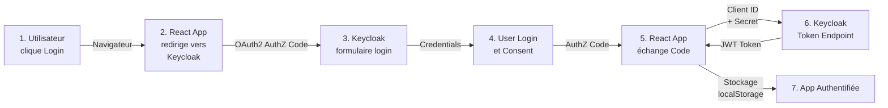

### Tokens JWT

```json
{
  "access_token": "eyJhbGc...",
  "token_type": "Bearer",
  "expires_in": 300,
  "refresh_expires_in": 1800,
  "refresh_token": "eyJhbGc...",
  "id_token": "eyJhbGc..."
}
```

**Claims dans le JWT:**
- `sub` (Subject): ID utilisateur unique
- `email`: Adresse email utilisateur
- `email_verified`: Vérification email
- `name`: Nom complet
- `preferred_username`: Identifiant préféré
- `realm_access.roles`: Rôles dans le realm
- `resource_access`: Rôles spécifiques au client
- `iat` (Issued At): Moment d'émission (timestamp)
- `exp` (Expiration): Moment d'expiration (5 minutes)
- `aud` (Audience): Client ID pour lequel le token est valide

### Sécurité des credentials

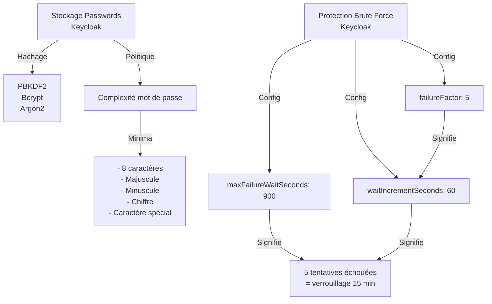

---

## 2. Autorisation - Contrôle d'accès basé sur les rôles (RBAC)

### Hiérarchie des rôles

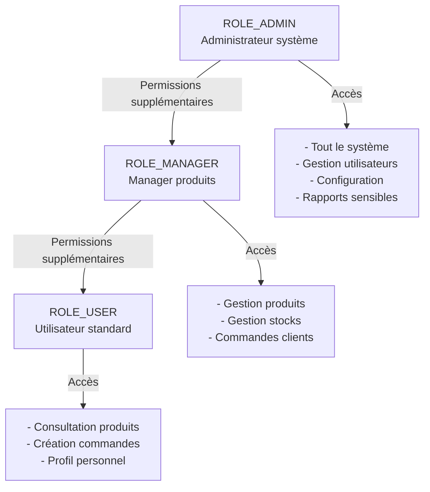

### Matrice de permissions

```
Rôle        | GET /products | POST /products | PUT /products | DELETE /products | GET /orders | POST /orders
------------|---------------|----------------|---------------|------------------|-------------|-------------
ROLE_USER   | OUI           | NON            | NON           | NON              | NON         | OUI
ROLE_MANAGER| OUI           | OUI            | OUI           | NON              | OUI         | OUI
ROLE_ADMIN  | OUI           | OUI            | OUI           | OUI              | OUI         | OUI
```

### Implémentation dans le code

**Spring Security Configuration:**

```java
.securityMatchers("/products/**")
  .authorizeHttpRequests()
    .requestMatchers(HttpMethod.GET, "/products")
      .hasAnyRole("USER", "MANAGER", "ADMIN")
    .requestMatchers(HttpMethod.POST, "/products")
      .hasAnyRole("MANAGER", "ADMIN")
    .requestMatchers(HttpMethod.DELETE, "/products/**")
      .hasRole("ADMIN")
    .anyRequest()
      .authenticated()

.securityMatchers("/orders/**")
  .authorizeHttpRequests()
    .requestMatchers(HttpMethod.GET, "/orders")
      .authenticated()
    .requestMatchers(HttpMethod.POST, "/orders")
      .hasAnyRole("USER", "MANAGER", "ADMIN")
    .anyRequest()
      .authenticated()
```

---

## 3. Sécurité des données en transit - TLS/SSL

### HTTPS et certificats

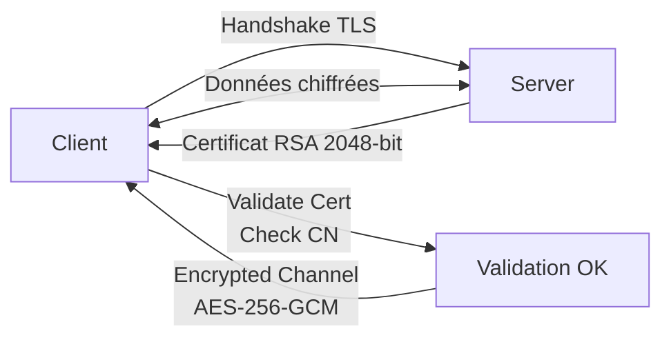

### Configuration pour production

```
- Protocole: TLS 1.2+ (minimum)
- Cipher Suites: AES-256-GCM, ChaCha20-Poly1305
- Certificats: Let's Encrypt ou CA réputée
- HSTS: Strict-Transport-Security header
- Perfect Forward Secrecy: Ephemeral keys
```

**En développement:**
- Localhost accepte HTTP non chiffré
- HTTPS peut être désactivé

---

## 4. Sécurité des données au repos

### Stockage sensible

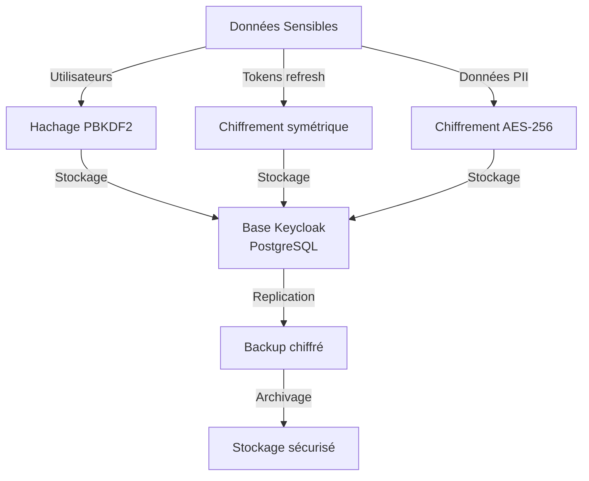

### Keycloak Storage

```
PostgreSQL Database
├── Realm Configuration (public)
├── User Credentials (hashed + salted)
├── Sessions (tokens)
└── Audit Log (toutes les authentifications)
```

---

## 5. Gestion des sessions

### Timeouts de session

```
Session Configuration dans Keycloak:
├── accessTokenLifespan: 300 secondes (5 minutes)
├── accessTokenLifespanForImplicitFlow: 900 secondes (15 minutes)
├── ssoSessionIdleTimeout: 1800 secondes (30 minutes)
├── ssoSessionMaxLifespan: 36000 secondes (10 heures)
├── offlineSessionIdleTimeout: 2592000 secondes (30 jours)
└── refreshTokenLifespan: dépend config
```

### Diagramme de cycle de vie

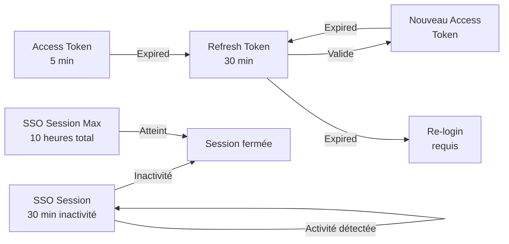

---

## 6. Protection contre les attaques courantes

### OWASP Top 10

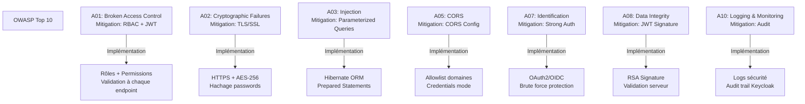

### Détails des mitigations

#### A01: Broken Access Control
```
- Validation JWT à chaque requête
- Vérification rôles requis
- Validation côté serveur (pas de confiance client)
- Audit des accès refusés
```

#### A02: Cryptographic Failures
```
- TLS 1.2+ obligatoire
- Hachage PBKDF2 pour passwords
- Signatures RSA pour JWT
- Pas de données sensibles en logs
```

#### A03: Injection
```
- ORM (Hibernate) avec prepared statements
- Validation input
- Parameterized queries
- Escaping output
```

#### A05: CORS (Cross-Origin Resource Sharing)
```
Allowed Origins:
- http://localhost:3000 (dev)
- https://domain.com (prod)

Methods: GET, POST, PUT, DELETE
Headers: Authorization, Content-Type
Credentials: true (allow cookies)
Max-Age: 3600 secondes
```

#### A07: Identification and Authentication
```
- Pas de plaintext passwords
- Minimum 8 caractères, complexité
- Brute force protection (5 tentatives = 15 min lockout)
- MFA/2FA possible via Keycloak
- Session timeout (30 min inactivité)
```

#### A08: Data Integrity Failures
```
- JWT signé avec RSA-256
- Signature validée à chaque use
- Impossible de modifier token sans clé privée
- Expiration stricte
- Audience validation
```

#### A10: Logging and Monitoring
```
Keycloak logs:
- Toutes les authentifications
- Tous les refus d'accès
- Changements de configuration
- Tentatives échouées
```

---

## 7. CORS (Cross-Origin Resource Sharing)

### Configuration

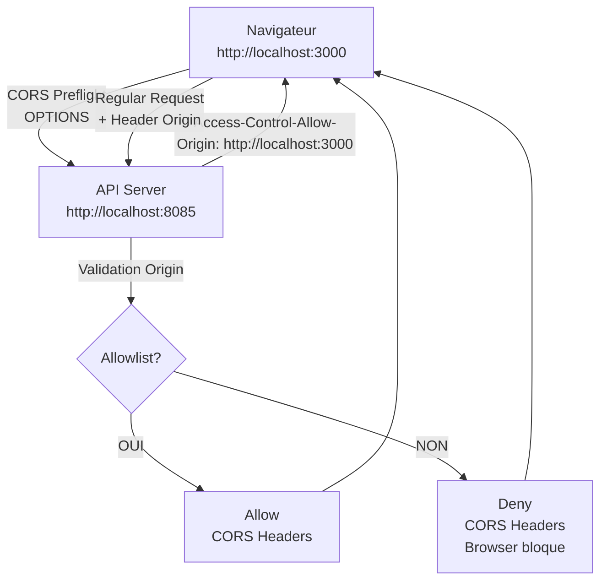

### Headers CORS critiques

```
Request (Browser):
  Origin: http://localhost:3000
  Access-Control-Request-Method: POST
  Access-Control-Request-Headers: Authorization, Content-Type

Response (Server):
  Access-Control-Allow-Origin: http://localhost:3000
  Access-Control-Allow-Methods: GET, POST, PUT, DELETE
  Access-Control-Allow-Headers: Authorization, Content-Type
  Access-Control-Allow-Credentials: true
  Access-Control-Max-Age: 3600
```

---

## 8. Protection des secrets

### Gestion des variables d'environnement

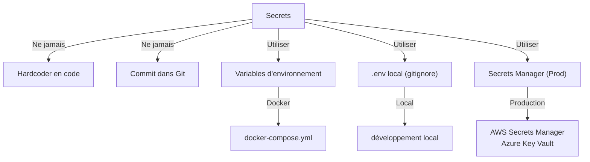

### Secrets critiques du projet

```
Keycloak Admin:
  - KEYCLOAK_ADMIN: admin
  - KEYCLOAK_ADMIN_PASSWORD: admin (DEV ONLY!)

Database:
  - POSTGRES_PASSWORD: keycloak_password (DEV ONLY!)
  - POSTGRES_USER: keycloak

OAuth2:
  - Client Secret (confidential clients)
  - JWT Signing Key (private)
```

---

## 9. Validation des entrées

### Input Validation Strategy

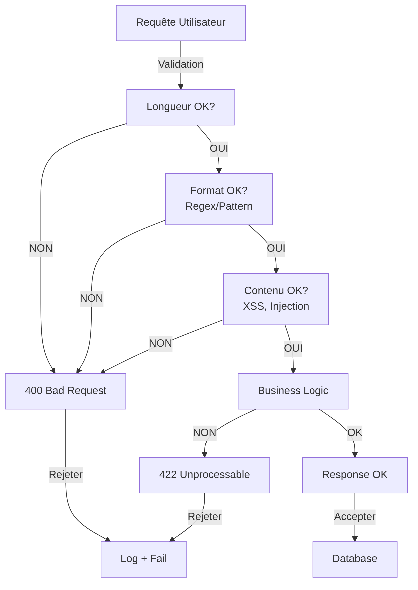

### Exemple Product Service

```
POST /products
Body: {
  "name": "Product Name",
  "price": 99.99,
  "description": "..."
}

Validations:
- name: NotNull, Length(min=3, max=255), Pattern "[a-zA-Z0-9\\s-]"
- price: NotNull, DecimalMin(0.01), DecimalMax(999999.99)
- description: NotNull, Length(min=10, max=1000)
- XSS check: StripHTML(description)
```

---

## 10. Logging et Audit

### Architecture de logging

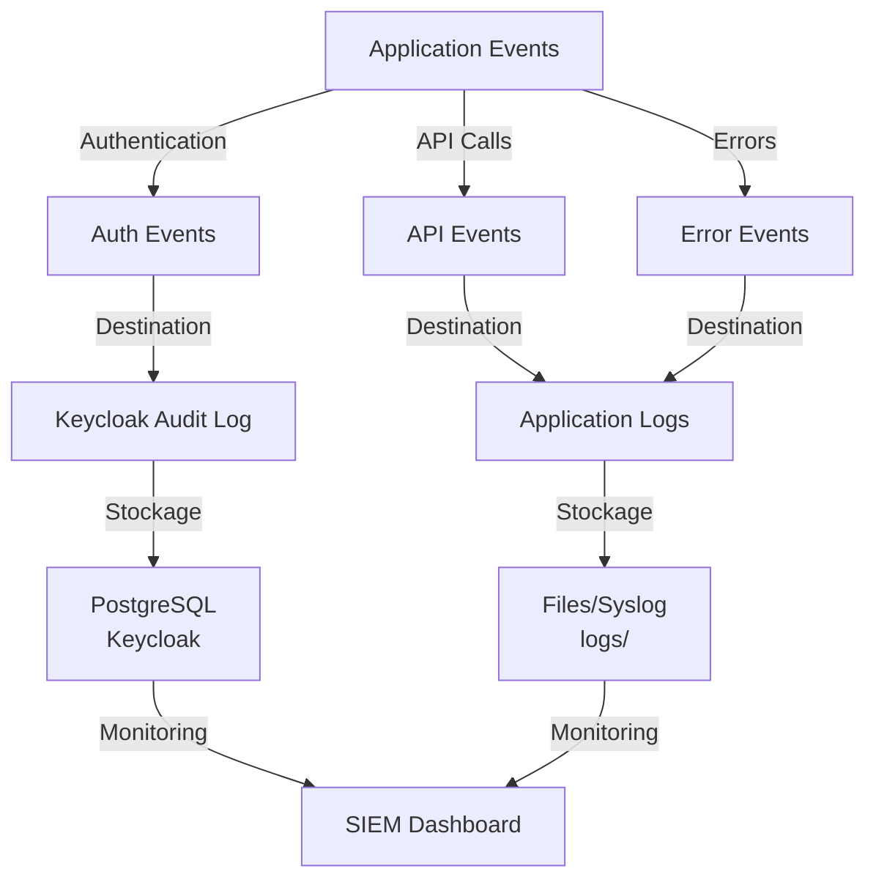

### Informations loggées

```
Authentication:
  - Timestamp
  - User ID / Username
  - Success / Failure
  - IP Address
  - User Agent
  - Reason if failed (invalid password, user not found, etc.)

API Calls:
  - Timestamp
  - User ID
  - Method (GET, POST, etc.)
  - Endpoint
  - Status Code
  - Response Time
  - IP Address

Errors:
  - Timestamp
  - Service Name
  - Error Type
  - Stack Trace
  - User affected (if applicable)
  - Severity (ERROR, WARN, etc.)
```

### Exemple log d'authentification

```
2024-01-12T10:30:45.123Z INFO  keycloak.authentication
  EventType: USER_LOGIN
  UserId: user-123
  Username: john.doe@example.com
  ClientId: react-client
  Success: true
  IpAddress: 192.168.1.100
  UserAgent: Mozilla/5.0...
  RealmId: microservices-realm
```

---

## Résumé de la posture de sécurité

```
Layer             | Mechanism              | Strength
------------------|------------------------|------------------
Authentication    | OAuth2/OIDC + Keycloak | Fort (Entreprise)
Authorization     | RBAC + JWT             | Fort (Granulaire)
Transit           | TLS 1.2+               | Fort (Chiffré)
At Rest           | AES-256 + Hash         | Fort (Chiffré)
Sessions          | Timeout + Refresh      | Modéré (5 min)
Input             | Validation + Escaping  | Modéré
Secrets           | Env Vars + Keycloak    | Modéré (DEV)
Audit             | Logging + Keycloak     | Bon
CORS              | Allowlist              | Bon
OWASP             | 8/10 mitigations       | Excellent
```

Voir aussi:
- [1_ARCHITECTURE_ET_FLUX.md](1_ARCHITECTURE_ET_FLUX.md) - Architecture globale
- [3_DEVSECOPS_PIPELINE.md](3_DEVSECOPS_PIPELINE.md) - Pipeline de sécurisation

---

## Perspectives futures

### Améliorations de sécurité planifiées

**Authentification avancée:**
- MFA (Multi-Factor Authentication) via TOTP/SMS
- WebAuthn/FIDO2 support
- Social login (Google, GitHub, Microsoft)
- Passwordless authentication

**Autorisation granulaire:**
- Attribute-Based Access Control (ABAC)
- Policy-based access control
- Resource-level permissions
- Time-based access restrictions

**Encryption et Secrets:**
- HashiCorp Vault integration
- End-to-end encryption
- Envelope encryption
- Key rotation automation

**Compliance et Audit:**
- GDPR compliance features
- PCI-DSS support
- Automated compliance reports
- Advanced threat detection

**Infrastructure de sécurité:**
- mTLS entre services
- Service mesh (Istio)
- Zero-trust network architecture
- Advanced WAF rules
