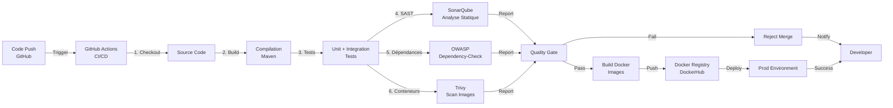
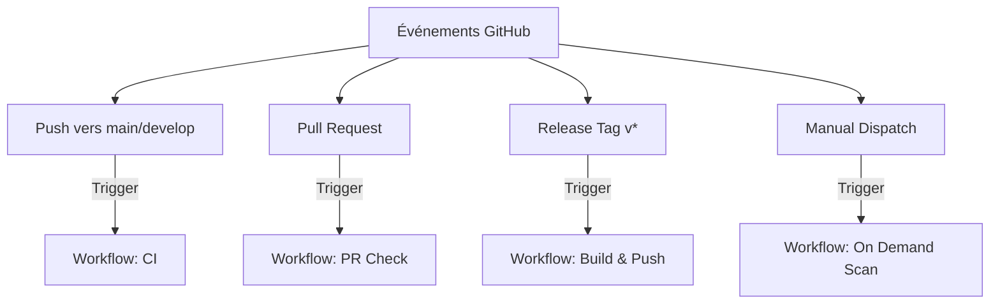
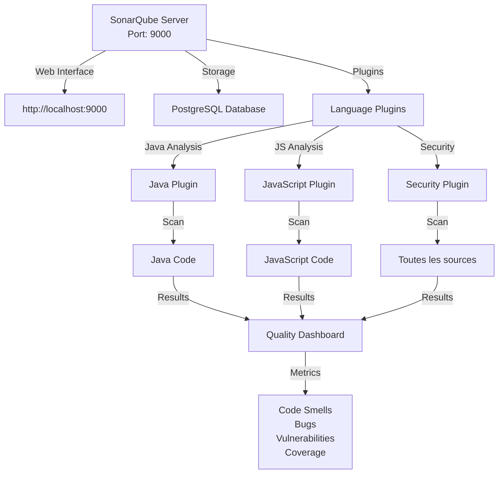
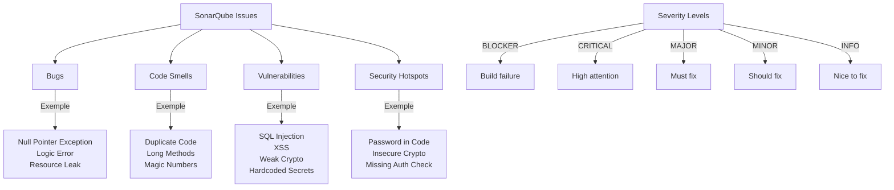
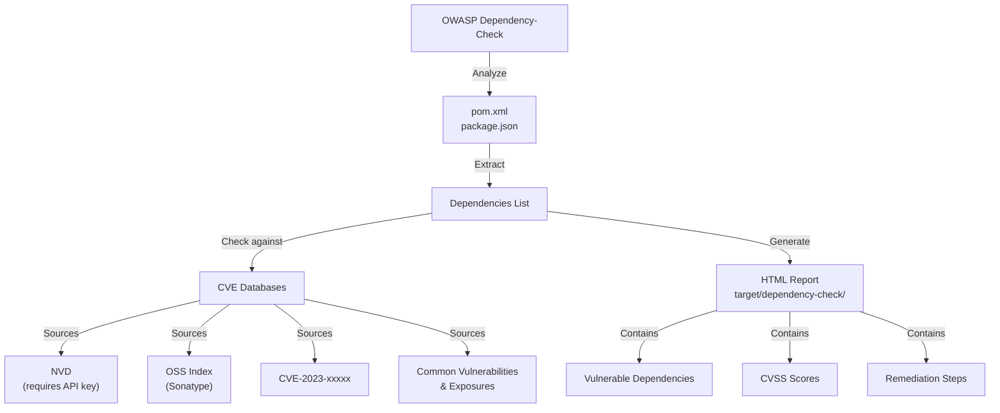
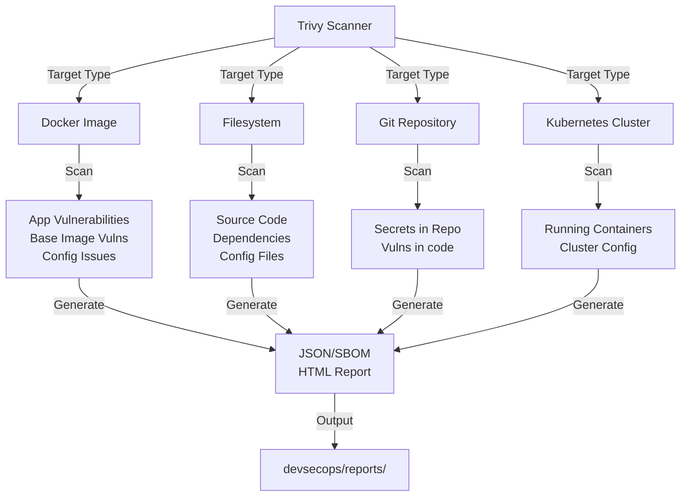
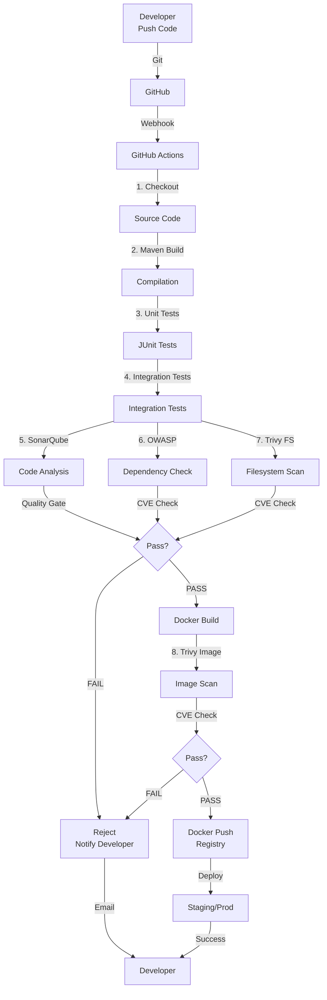
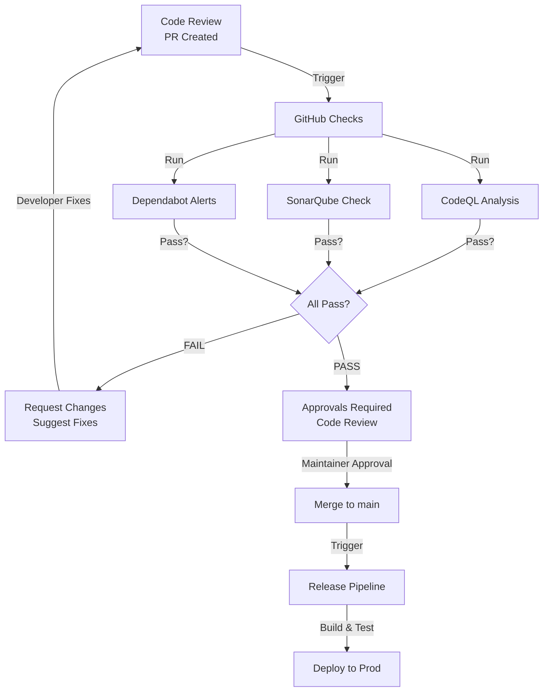

# Pipeline DevSecOps

## Vue d'ensemble

Ce document décrit le pipeline DevSecOps intégré pour l'analyse continue de la sécurité, de la qualité du code et des vulnérabilités à travers tout le cycle de développement et de déploiement.

---

## Architecture du Pipeline DevSecOps

### Diagramme d'ensemble



---

## 1. GitHub Actions - CI/CD Pipeline

### Trigger et événements



### Workflow standard CI

```yaml
name: CI - Build & Test

on:
  push:
    branches: [main, develop]
  pull_request:
    branches: [main, develop]

jobs:
  build:
    runs-on: ubuntu-latest
    steps:
      - uses: actions/checkout@v3
      
      - name: Setup Java
        uses: actions/setup-java@v3
        with:
          java-version: '21'
      
      - name: Build with Maven
        run: mvn clean compile
      
      - name: Run Tests
        run: mvn test
      
      - name: Build JAR
        run: mvn package -DskipTests
      
      - name: SonarQube Analysis
        run: mvn sonar:sonar -Dsonar.login=${{ secrets.SONAR_TOKEN }}
      
      - name: OWASP Dependency Check
        run: mvn dependency-check:check
      
      - name: Trivy Scan
        run: trivy fs --format json --output trivy-report.json .
      
      - name: Upload Reports
        uses: actions/upload-artifact@v3
        with:
          name: security-reports
          path: |
            sonar-*.json
            target/dependency-check/
            trivy-report.json
```

### Webhook Notifications

```
Post-build notifications:
├── Slack: #security-alerts
├── Email: security-team@company.com
├── GitHub: Merge commit status
└── Dashboard: Results consolidation
```

---

## 2. SonarQube - Analyse Statique du Code (SAST)

### Architecture SonarQube



### Métriques de qualité analysées

```
Quality Gate:
├── Code Coverage: >= 80%
├── Duplication: < 5%
├── Maintainability Rating: A
├── Reliability Rating: A
├── Security Rating: A
├── Technical Debt: < 5 days
└── Security Hotspots Reviewed: 100%
```

### Lancement du scan SonarQube

```bash
# Configuration locale
cd gateway/
mvn clean compile sonar:sonar \
  -Dsonar.projectKey=gateway \
  -Dsonar.host.url=http://localhost:9000 \
  -Dsonar.login=admin \
  -Dsonar.password=admin

# Ou pour tous les services
bash devsecops/run-devsecops-scan.sh
```

### Types de problèmes détectés



### Dashboard SonarQube

```
Accessible at: http://localhost:9000
Default credentials: admin / admin

Views:
├── Projects: Liste des projets scannés
├── Issues: Tous les problèmes identifiés
├── Security: Vulnérabilités et hotspots
├── Code: Duplication et smells
├── Measures: Métriques globales
└── Activity: Historique des analyses
```

---

## 3. OWASP Dependency-Check - Analyse des dépendances

### Objectif

Identifier les dépendances avec des vulnérabilités connues (CVE).

### Configuration



### Statut actuel du projet

**Configuration:** Mode hors-ligne (sans NVD API)
- Raison: NVD nécessite une API key depuis décembre 2023
- Solution: Utiliser Trivy pour les vulnérabilités (meilleure alternative)

### Lancement du scan

```bash
# Service spécifique
cd gateway/
mvn dependency-check:check

# Tous les services
bash devsecops/run-devsecops-scan.sh

# Rapport généré
open target/dependency-check/dependency-check-report.html
```

### Interprétation des résultats

```
Rapport HTML:
├── Summary: Nombre dépendances vulnérables
├── Dependencies: Liste avec CVSS scores
├── Vulnerabilities: CVEs associées
└── Remediation: Versions patchées disponibles
```

### CVSS Score (Severity)

```
0.0         : None
0.1-3.9     : Low
4.0-6.9     : Medium
7.0-8.9     : High
9.0-10.0    : Critical

Example:
"axios": "^1.13.2"
  CVE-2023-xxxx: CVSS 6.1 (Medium)
  Fix: Upgrade to 1.13.3+
```

---

## 4. Trivy - Scan des Images Docker et Filesystems

### Architecture Trivy



### Utilisation

```bash
# Installer Trivy (script inclus)
bash devsecops/install-trivy.sh

# Scan d'un filesystem (source code)
trivy fs --format json --output trivy-fs-report.json .

# Scan d'une image Docker
trivy image --format json --output trivy-image-report.json gateway:latest

# Scan complet avec tous les services
bash devsecops/run-devsecops-scan.sh
```

### Avantages de Trivy

```
Avantages:
- Gratuit et open-source
- Sans clé API requise
- Très rapide (quelques secondes)
- Couvre: images Docker, source code, config
- Excellente base de données CVE
- Output JSON/SBOM/SARIF pour intégration CI

Comparaison avec Dependency-Check:
  Trivy           | Dependency-Check
  Rapide          | Lent
  Moderne         | Hérité
  Sans config     | Complexe
  Complet         | Basique
```

### Résultats et interprétation

```json
{
  "ArtifactType": "image",
  "ArtifactName": "gateway:latest",
  "Results": [
    {
      "Target": "gateway:latest",
      "Type": "application",
      "Vulnerabilities": [
        {
          "VulnerabilityID": "CVE-2023-12345",
          "PkgName": "log4j-core",
          "InstalledVersion": "2.14.0",
          "FixedVersion": "2.17.1",
          "Severity": "CRITICAL",
          "Title": "Apache Log4j2 Remote Code Execution"
        }
      ]
    }
  ]
}
```

### Niveau de sévérité

```
CRITICAL  : Exploit actif, correction immédiate requise
HIGH      : Exploit probable, correction urgente
MEDIUM    : Exploitation possible, correction planifiée
LOW       : Exploitation improbable, correction préviée
UNKNOWN   : Sévérité indéterminée
```

---

## 5. Integration continue du Pipeline complet

### Diagramme du flux complet



### Étapes du pipeline détaillées

```bash
STAGE 1: Checkout & Setup
├── Git clone repository
├── Setup Java 21
├── Cache Maven dependencies
└── Display environment info

STAGE 2: Build
├── mvn clean compile
├── Compile Java source code
├── Compile TypeScript/JavaScript
└── Validate build configuration

STAGE 3: Testing
├── mvn test (unit tests)
├── npm test (frontend tests)
├── Integration tests
└── Coverage report (aim: >= 80%)

STAGE 4: Security Scanning
├── SonarQube Analysis
│   ├── Code Smells
│   ├── Bugs
│   ├── Vulnerabilities
│   └── Security Hotspots
├── OWASP Dependency-Check
│   ├── Maven dependencies
│   ├── NPM dependencies
│   └── CVE matching
└── Trivy Filesystem Scan
    ├── Source code secrets
    ├── Config vulnerabilities
    └── Dependency vulnerabilities

STAGE 5: Quality Gate
├── If any critical issue: FAIL
├── If code coverage < 80%: FAIL
├── If CVSS >= 7.0: FAIL
└── Otherwise: PASS

STAGE 6: Docker Build & Scan
├── Build Docker image
├── Tag image
├── Trivy scan image
├── Check base image vulnerabilities
└── If pass: push to registry

STAGE 7: Deployment
├── Pull image from registry
├── Deploy to Kubernetes/Docker Swarm
├── Health checks
└── Smoke tests
```

---

## 6. Rapports et Artifacts

### Génération des rapports

```bash
# Répertoire des rapports
devsecops/reports/
├── dependency-check-gateway-20240112/
│   ├── dependency-check-report.html
│   └── dependency-check-report.json
├── trivy-filesystem-20240112/
│   ├── trivy-fs-gateway.json
│   ├── trivy-fs-order-service.json
│   ├── trivy-fs-product-service.json
│   └── trivy-fs-react-app.json
└── sonarqube/
    ├── gateway-analysis.json
    ├── order-service-analysis.json
    ├── product-service-analysis.json
    └── react-app-analysis.json
```

### Consultation des rapports

```bash
# SonarQube Web Dashboard
http://localhost:9000

# OWASP Dependency-Check HTML
open devsecops/reports/dependency-check-*/dependency-check-report.html

# Trivy JSON reports
cat devsecops/reports/trivy-filesystem-*/trivy-fs-*.json | jq

# Script de consultation
bash devsecops/run-devsecops-scan.sh
# Affiche résumé des résultats
```

---

## 7. GitHub Security & Code Scanning

### Activation dans GitHub

```
Repository Settings:
├── Security
│   ├── Code Scanning
│   │   ├── Enable CodeQL analysis
│   │   ├── Add SonarQube integration
│   │   └── Add custom CI checks
│   ├── Dependabot
│   │   ├── Enable Dependabot alerts
│   │   ├── Enable Dependabot updates
│   │   └── Enable Dependency graph
│   ├── Secret Scanning
│   │   └── Enable push protection
│   └── Branch Protection Rules
│       ├── Require status checks to pass
│       ├── Require code review
│       └── Dismiss stale reviews
```

### Workflow de sécurité recommandé



---

## 8. Commandes utiles

### Lancer tous les scans

```bash
# Script complet
bash devsecops/run-devsecops-scan.sh

# Ou service spécifique
bash devsecops/run-devsecops-scan.sh gateway
```

### Scans individuels

```bash
# SonarQube
cd gateway/
mvn sonar:sonar -Dsonar.login=admin

# OWASP Dependency-Check
mvn dependency-check:check

# Trivy Filesystem
trivy fs --format json --output report.json .

# Trivy Docker Image
trivy image gateway:latest --format json --output image-report.json
```

### Affichage des résultats

```bash
# Lister tous les rapports
ls -la devsecops/reports/

# Ouvrir SonarQube dashboard
open http://localhost:9000

# Consulter rapport Trivy
cat devsecops/reports/trivy-*/trivy-fs-*.json | jq '.Results[].Vulnerabilities'

# Voir log du scan
tail -f logs/devsecops-scan.log
```

### Démarrage des outils

```bash
# SonarQube (écoute sur port 9000)
cd sonarqube/
docker-compose up -d
# Attendre 30 secondes pour démarrage

# Vérifier statut
docker-compose logs -f sonarqube

# Installer Trivy
bash devsecops/install-trivy.sh

# Vérifier installation
trivy version
```

---

## 9. Bonnes pratiques du DevSecOps

### Principes clés

```
1. Security by Design
   - Sécurité intégrée dès le départ
   - Threat modeling
   - Secure architecture patterns

2. Shift Left
   - Tests de sécurité dès le développement
   - Feedback immédiat aux développeurs
   - Prevention plutôt que correction

3. Continuous Integration
   - Scans automatisés à chaque commit
   - Quality gates obligatoires
   - Rapports accessibles

4. Automation
   - Pipeline entièrement automatisé
   - Aucune étape manuelle
   - Reproductibilité garantie

5. Monitoring & Response
   - Alertes en temps réel
   - Incident response plan
   - Post-mortems
```

### Checklist avant production

```
Code:
[ ] Pas de hardcoded secrets
[ ] Validation d'inputs
[ ] Proper error handling
[ ] Logging sans PII
[ ] Code review effectuée

Dependencies:
[ ] Pas de vulnérabilités CRITICAL
[ ] Pas de vulnérabilités HIGH non justifiées
[ ] Licenses compatibles

Infrastructure:
[ ] TLS/HTTPS activé
[ ] Firewall configuré
[ ] Secrets dans vault/env vars
[ ] Backups en place
[ ] Monitoring activé

Security:
[ ] RBAC configuré
[ ] Sessions timeouts OK
[ ] Audit logging activé
[ ] Encryption at rest + transit
[ ] DDoS protection OK
```

---

## 10. Troubleshooting

### Problème: NVD API 403 Error

**Symptôme:** `NvdApiException: NVD Returned Status Code: 403`

**Solution:** 
- Le projet est configuré pour mode hors-ligne
- Utiliser Trivy à la place
- Voir [devsecops/OWASP_CONFIGURATION.md](../devsecops/OWASP_CONFIGURATION.md)

### Problème: SonarQube inaccessible

**Symptôme:** `Connection refused on http://localhost:9000`

**Solution:**
```bash
cd sonarqube/
docker-compose up -d
sleep 30  # Attendre le démarrage
```

### Problème: Trivy pas installé

**Solution:**
```bash
bash devsecops/install-trivy.sh
trivy version
```

### Problème: Quality Gate failed

**Solution:**
1. Consulter SonarQube dashboard: http://localhost:9000
2. Identifier les issues bloquantes
3. Corriger le code
4. Relancer les tests
5. Vérifier la couverture de code (>= 80%)

---

## Résumé

```
Pipeline DevSecOps du projet:

Code → Commit → GitHub Actions → SonarQube
                                ├→ OWASP Dependency-Check
                                ├→ Trivy Filesystem
                                └→ Quality Gate

        ↓ (si Pass) ↓

Docker Build → Trivy Image Scan → Docker Registry → Prod

Outils actifs:
- SonarQube (localhost:9000)
- OWASP Dependency-Check (Maven)
- Trivy (Recommandé, gratuit)
- GitHub Actions (CI/CD)
- GitHub Code Scanning

Rapports: devsecops/reports/
Logs: logs/
```

Voir aussi:
- [1_ARCHITECTURE_ET_FLUX.md](1_ARCHITECTURE_ET_FLUX.md) - Architecture globale
- [2_PRINCIPES_SECURITE.md](2_PRINCIPES_SECURITE.md) - Principes de sécurité
- [../devsecops/README.md](../devsecops/README.md) - Guide rapide DevSecOps
- [../devsecops/OWASP_CONFIGURATION.md](../devsecops/OWASP_CONFIGURATION.md) - Configuration OWASP

---

## Perspectives futures

### Améliorations du pipeline DevSecOps

**Tooling et Automation:**
- Container image signing (Cosign)
- SBOM generation (CycloneDX)
- Infrastructure as Code scanning (Terraform/CloudFormation)
- API security testing (OWASP ZAP)
- Dynamic Application Security Testing (DAST)

**Détection avancée:**
- Machine Learning pour anomaly detection
- Behavioral analysis des commits
- Supply chain security (SLSA)
- Malware scanning

**Conformité et Rapports:**
- Automated compliance checks (NIST, ISO 27001)
- Continuous ATO (Authority to Operate)
- Risk scoring automatisé
- Executive dashboards

**Intégration avec infrastructure:**
- GitOps workflow (ArgoCD)
- Policy enforcement (OPA/Gatekeeper)
- Runtime security (Falco)
- Secrets scanning (TruffleHog)

**Performance et Scale:**
- Distributed scanning
- Cache optimization
- Parallel execution
- Cloud-native tooling
