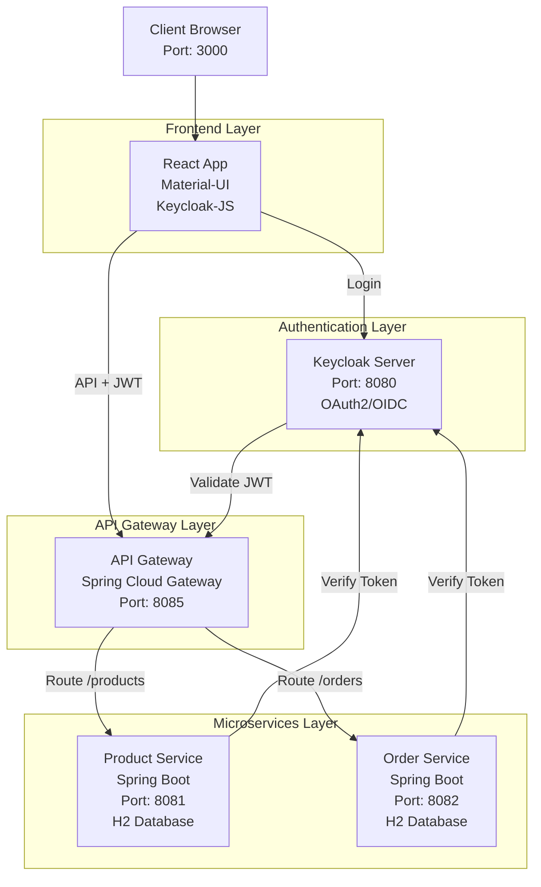
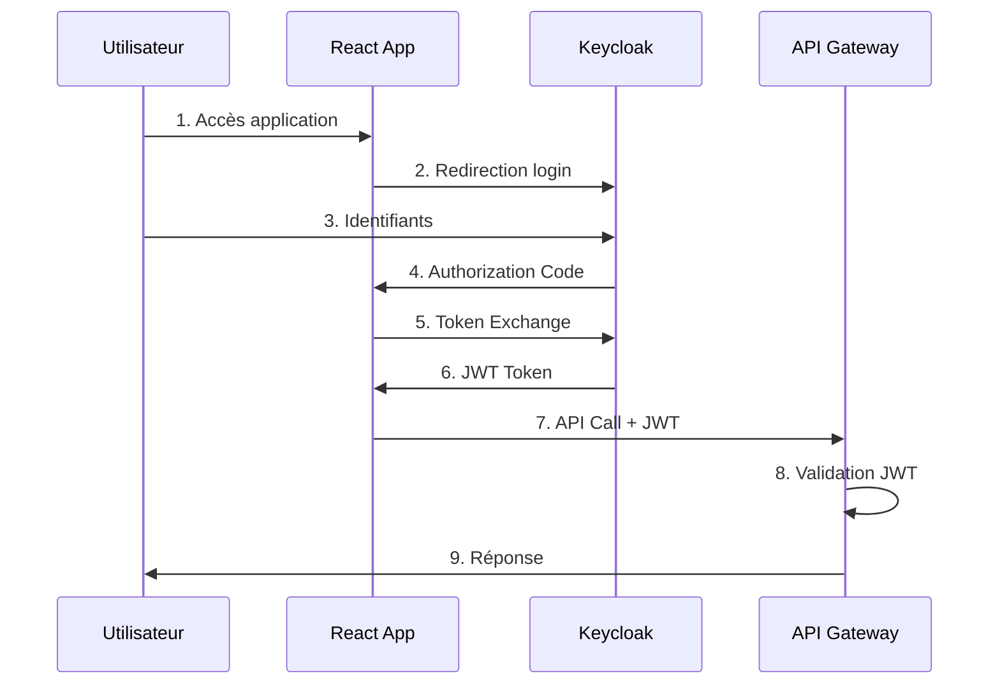
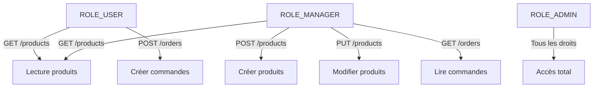
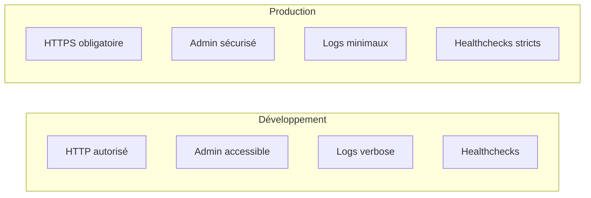

# OAuth2/OIDC Secure E-Commerce Microservices

Architecture microservices sécurisée avec authentification centralisée OAuth2/OIDC via Keycloak. Ce projet démontre une implémentation complète des meilleures pratiques de sécurité incluant RBAC, DevSecOps, et conformité OWASP.

---

## Caractéristiques principales

### Architecture
- Architecture microservices avec API Gateway Spring Cloud
- Services indépendants: Product Service, Order Service
- Orchestration via Docker Compose
- Health checks automatiques

### Sécurité
- **Authentification**: OAuth2/OIDC via Keycloak 26.0.0
- **Autorisation**: Contrôle d'accès basé sur les rôles (RBAC)
- **Chiffrement**: TLS/SSL en transit, AES-256 au repos
- **Tokens**: JWT signés RSA-256 avec expiration 5 minutes
- **Protection**: CORS, validation d'inputs, brute-force protection
- **Audit**: Logging complet des authentifications

### DevSecOps
- **SAST**: SonarQube pour analyse statique du code (localhost:9000)
- **Dépendances**: OWASP Dependency-Check + Trivy scanning
- **Images Docker**: Scan des vulnérabilités avec Trivy
- **CI/CD**: GitHub Actions avec SonarQube quality gates
- **Rapports**: Génération automatique de rapports de sécurité

### Technologies
- **Backend**: Spring Boot 3.5.9, Java 21
- **Frontend**: React 19.2.1, Material-UI 7.3.7
- **Auth**: Keycloak 26.0.0 (OAuth2/OIDC)
- **Database**: PostgreSQL 15 (Keycloak), H2 (Services)
- **Conteneurisation**: Docker & Docker Compose

---

## Architecture rapide



---

## Démarrage rapide

### Prérequis

- Docker & Docker Compose
- Java 21 (optionnel, pour compilation locale)
- Maven 3.8+ (optionnel)
- Node.js 18+ (optionnel, frontend)

### Installation

1. **Cloner le repository**
```bash
git clone https://github.com/omarelkd/Secure-Ecom-Application.git
cd Secure-Ecom-Application
```

2. **Démarrer les services**
```bash
# Démarrer tous les conteneurs
docker-compose up -d

# Vérifier le statut
docker-compose ps
```

3. **Accéder à l'application**

| Service | URL | Credentials |
|---------|-----|-------------|
| Frontend | http://localhost:3000 | Login via Keycloak |
| API Gateway | http://localhost:8085 | Requires JWT Token |
| Keycloak | http://localhost:8080 | admin / admin |
| SonarQube | http://localhost:9000 | admin / admin |

4. **Test basique**
```bash
# Récupérer un token
TOKEN=$(curl -X POST http://localhost:8080/realms/microservices-realm/protocol/openid-connect/token \
  -H "Content-Type: application/x-www-form-urlencoded" \
  -d "client_id=react-client&username=user&password=password&grant_type=password" | jq -r '.access_token')

# Appeler l'API
curl -H "Authorization: Bearer $TOKEN" http://localhost:8085/products
```

### Arrêt des services

```bash
docker-compose down

# Avec suppression des volumes
docker-compose down -v
```

---

## Structure du projet

```
projet_ouath2_oidc/
├── Documentation/
│   ├── 1_ARCHITECTURE_ET_FLUX.md       # Architecture & flux avec Mermaid
│   ├── 2_PRINCIPES_SECURITE.md         # Sécurité implémentée
│   └── 3_DEVSECOPS_PIPELINE.md         # Pipeline DevSecOps
│
├── gateway/                            # API Gateway Spring Cloud
│   ├── src/main/java/
│   ├── pom.xml
│   └── Dockerfile
│
├── product-service/                    # Microservice Produits
│   ├── src/main/java/
│   ├── pom.xml
│   └── Dockerfile
│
├── order-service/                      # Microservice Commandes
│   ├── src/main/java/
│   ├── pom.xml
│   └── Dockerfile
│
├── react-app/                          # Frontend React
│   ├── src/
│   ├── package.json
│   └── Dockerfile
│
├── keycloak/                           # Configuration Keycloak
│   ├── realm-export.json               # Realm pré-configuré
│   └── docker-compose.yml
│
├── sonarqube/                          # Configuration SonarQube
│   └── docker-compose.yml
│
├── devsecops/                          # Pipeline de sécurité
│   ├── run-devsecops-scan.sh
│   ├── install-trivy.sh
│   └── reports/
│
├── docker-compose.yml                  # Orchestration
├── docker-compose.prod.yml             # Config production
├── Makefile                            # Commandes
└── README.md                           # Ce fichier
```

---

## Configuration Keycloak

### Realm pré-configuré

**Realm:** `microservices-realm`
- Protection brute-force: 5 tentatives = 15 min lockout
- Sessions timeouts: 5 minutes
- Rôles: ROLE_USER, ROLE_MANAGER, ROLE_ADMIN

**Clients:**
- `react-client`: Frontend public
- `gateway`: Backend ressources

**Utilisateurs de test:**
- `user` / `password` - ROLE_USER
- `admin` / `admin` - ROLE_ADMIN  
- `manager` / `manager` - ROLE_MANAGER

### Import automatique

Le realm-export.json est importé automatiquement au démarrage de Keycloak.

---

## Services API implémentés

### Product Service (Port 8081)

**Endpoints accessibles:**
- `GET /products` - Tous les produits (ROLE_USER+)
- `GET /products/{id}` - Détail produit (ROLE_USER+)
- `POST /products` - Créer (ROLE_MANAGER+)
- `PUT /products/{id}` - Modifier (ROLE_MANAGER+)
- `DELETE /products/{id}` - Supprimer (ROLE_ADMIN)

### Order Service (Port 8082)

**Endpoints accessibles:**
- `GET /orders` - Mes commandes (ROLE_USER+)
- `GET /orders/{id}` - Détail commande (Owner ou ROLE_ADMIN)
- `POST /orders` - Créer commande (ROLE_USER+)
- `PUT /orders/{id}/status` - Modifier statut (ROLE_MANAGER+)
- `DELETE /orders/{id}` - Annuler (ROLE_ADMIN)

### API Gateway (Port 8085)

Passerelle centralisée:
- Routage automatique vers services
- Validation JWT obligatoire
- Routage par chemin

---

## Sécurité - Implémentation actuelle

### Authentification OAuth2/OIDC



### Contrôle d'accès (RBAC)



### Principes de sécurité implémentés

- Authentification centralisée OAuth2/OIDC (Keycloak)
- Autorisation basée sur tokens JWT
- Chiffrement TLS/SSL en transit
- Validation des entrées (Input validation)
- Protection CORS avec allowlist
- Logging & Audit trail complet
- Sessions avec timeout (5 minutes)
- Protection contre brute-force (5 tentatives = 15 min lockout)
- Secrets dans variables d'environnement

Pour la documentation complète des principes de sécurité, voir: [Documentation/2_PRINCIPES_SECURITE.md](Documentation/2_PRINCIPES_SECURITE.md)

---

## DevSecOps Pipeline

### Scans de sécurité automatiques

Le projet inclut une suite complète de scans de sécurité:

#### SonarQube (Analyse Statique)
- Code Smells
- Bugs potentiels
- Vulnerabilités de code
- Security Hotspots
- Coverage de code

```bash
cd sonarqube/
docker-compose up -d
# Accès: http://localhost:9000
```

#### OWASP Dependency-Check
- Analyse des dépendances
- Détection CVE
- Rapport de vulnérabilités

```bash
mvn dependency-check:check
```

#### Trivy (Recommandé)
- Scan des images Docker
- Détection CVE dans dépendances
- Très rapide et précis

```bash
trivy fs --format json --output report.json .
trivy image gateway:latest
```

### Lancer les scans

```bash
# Tous les scans
bash devsecops/run-devsecops-scan.sh

# Service spécifique
bash devsecops/run-devsecops-scan.sh gateway

# Consulter les rapports
ls -la devsecops/reports/
```

### GitHub Actions CI/CD

Workflow automatique sur push/PR:
- Build et tests
- SonarQube analysis
- Dependency scanning
- Docker image scan
- Quality gates

Voir: `.github/workflows/`

Pour la documentation complète du DevSecOps, voir: [Documentation/3_DEVSECOPS_PIPELINE.md](Documentation/3_DEVSECOPS_PIPELINE.md)

---

## Commandes utiles

### Docker Compose

```bash
# Démarrer tous les services
docker-compose up -d

# Voir les logs
docker-compose logs -f

# Logs d'un service spécifique
docker-compose logs -f gateway

# Arrêter
docker-compose down

# Arrêter et supprimer les données
docker-compose down -v

# Vérifier statut
docker-compose ps

# Reconstruire les images
docker-compose build --no-cache
```

### Services individuels

```bash
# Frontend React
npm install
npm start

# Backend Services
mvn clean install
mvn spring-boot:run

# Tests
mvn test

# Build production
mvn clean package -DskipTests
```

### Keycloak

```bash
# Admin Console
http://localhost:8080/admin
# Username: admin
# Password: admin

# Realm configuration
# Fichier: keycloak/realm-export.json

# Export realm
docker-compose exec keycloak /opt/keycloak/bin/kcadm.sh \
  export -r microservices-realm \
  -u admin -p admin \
  -f /tmp/realm-export.json
```

### Vérification de santé

```bash
# Tous les services
bash check-all-services.sh

# Services spécifiques
bash check-services.sh gateway
bash check-services.sh product-service
bash check-services.sh order-service
bash check-services.sh keycloak
```

### Build et déploiement

```bash
# Build Docker images
bash build-docker-images.sh

# Start services
bash docker-start.sh

# Stop services
bash docker-stop.sh

# Test complet
bash test-docker.sh
```

---

## Configuration de production

### Déploiement production

```bash
# Utiliser la configuration production
docker-compose -f docker-compose.prod.yml up -d
```

### Différences production/développement



### Variables d'environnement critiques

Configuration dans `.env` ou docker-compose:
- `KEYCLOAK_ADMIN_PASSWORD`: Mot de passe admin Keycloak
- `POSTGRES_PASSWORD`: Mot de passe base Keycloak
- `KC_HOSTNAME`: Domaine Keycloak
- `REACT_APP_KEYCLOAK_URL`: URL Keycloak frontend
- `REACT_APP_API_URL`: URL API Gateway frontend

---

## Contributions et développement

### Workflow de contribution

1. Fork le repository
2. Créer une branche feature (`git checkout -b feature/amazing-feature`)
3. Commit les changements (`git commit -m 'Add amazing feature'`)
4. Push vers la branche (`git push origin feature/amazing-feature`)
5. Ouvrir une Pull Request

### Tests avant PR

```bash
# Tests unitaires
mvn test

# Tests intégration
mvn verify

# SonarQube local
mvn sonar:sonar -Dsonar.login=admin

# Trivy scan
trivy fs .
```

### Standards de code

- Java: SonarQube configuration
- JavaScript: ESLint + Prettier
- SQL: Parameterized queries only
- Security: OWASP guidelines

---

## Support et documentation

### Ressources

| Ressource | Lien |
|-----------|------|
| Architecture | [Documentation/1_ARCHITECTURE_ET_FLUX.md](Documentation/1_ARCHITECTURE_ET_FLUX.md) |
| Sécurité | [Documentation/2_PRINCIPES_SECURITE.md](Documentation/2_PRINCIPES_SECURITE.md) |
| DevSecOps | [Documentation/3_DEVSECOPS_PIPELINE.md](Documentation/3_DEVSECOPS_PIPELINE.md) |
| Keycloak Docs | https://www.keycloak.org/documentation |
| Spring Cloud Gateway | https://spring.io/projects/spring-cloud-gateway |
| SonarQube | http://localhost:9000 |

### Issues et bugs

Signaler les problèmes sur GitHub Issues avec:
- Description du problème
- Étapes de reproduction
- Logs pertinents
- Environnement (OS, versions)

### Questions?

Ouvrir une discussion GitHub ou contacter l'équipe DevSecOps.

---

## License

Ce projet est fourni à titre d'exemple éducatif. Consulter le fichier LICENSE pour les détails.

---

## Statut du projet et Perspectives

### État actuel

```mermaid
graph LR
    A["Architecture<br/>Complète"]
    B["OAuth2/OIDC<br/>Implémenté"]
    C["RBAC<br/>Implémenté"]
    D["Chiffrement<br/>Implémenté"]
    E["Audit &<br/>Logging"]
    F["SonarQube<br/>Actif"]
    G["GitHub<br/>Actions"]
    H["Documentation<br/>Complète"]
    
    A ---|Fonctionnel| B
    B ---|Fonctionnel| C
    C ---|Fonctionnel| D
    D ---|Fonctionnel| E
    E ---|Fonctionnel| F
    F ---|Fonctionnel| G
    G ---|Fonctionnel| H
```



### Perspectives futures

**Phase 1: Observabilité**
- Intégration ELK Stack
- Prometheus metrics
- Jaeger distributed tracing

**Phase 2: Scalabilité**
- Migration Kubernetes
- Cache distribué (Redis)
- Message broker (RabbitMQ)

**Phase 3: Sécurité avancée**
- Vault integration
- mTLS entre services
- WAF (Web Application Firewall)

---

## License

Ce projet est fourni à titre d'exemple éducatif pour démontrer les meilleures pratiques de sécurité dans une architecture microservices.

**Démarrage rapide:**

```bash
git clone https://github.com/omarelkd/Secure-Ecom-Application.git
cd Secure-Ecom-Application
docker-compose up -d
```

Accédez à http://localhost:3000

Documentation: [Documentation/](Documentation/)
